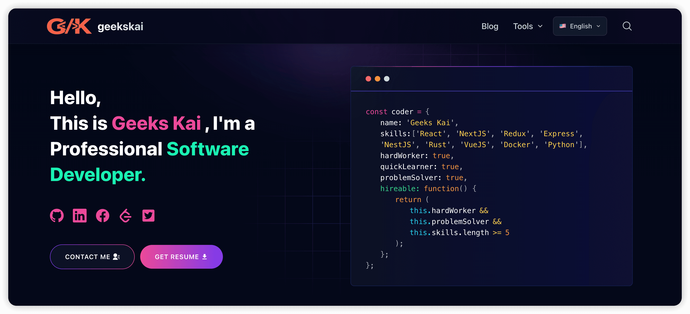
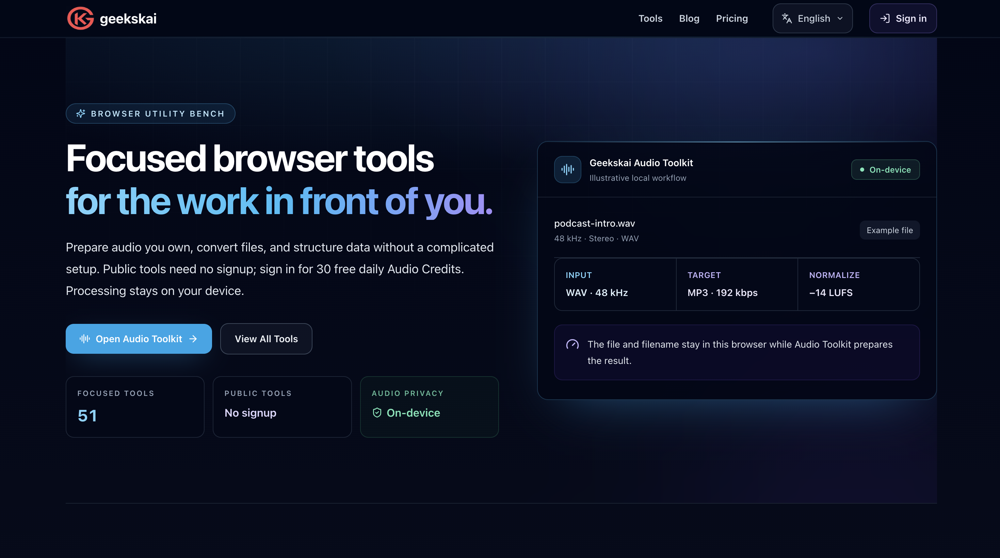
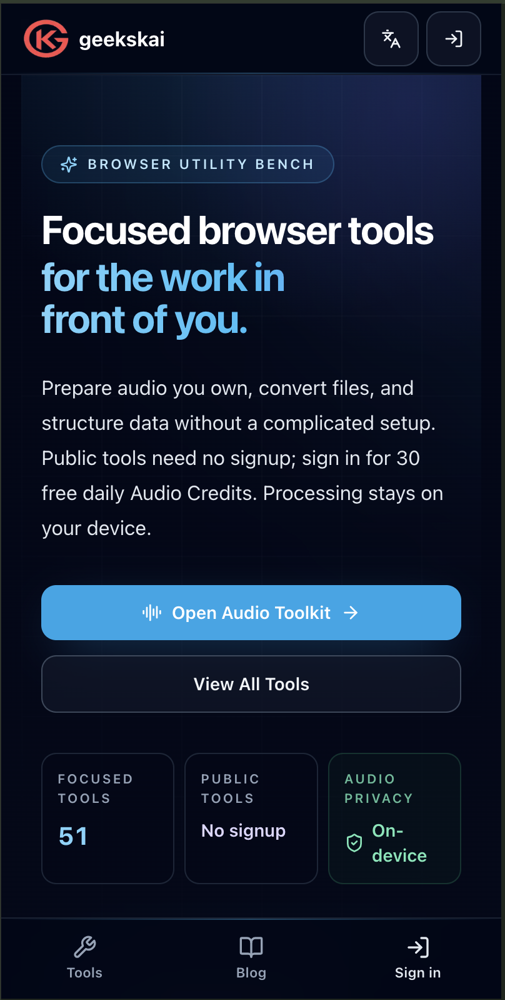

# GeeksKai Tools

<div align="center">

[](https://geekskai.com/)

**面向开发者和创作者的免费在线工具，以及本地优先的音频工作区。**

[在线站点](https://geekskai.com/) · [English README](README.md) · [GitHub](https://github.com/geekskai/blog)

[](LICENSE)
[](https://nextjs.org/)
[](https://www.typescriptlang.org/)
[](https://tailwindcss.com/)

</div>

GeeksKai 是一个基于 Next.js 的多语言应用，包含实用的浏览器工具、面向搜索的内容系统，以及 Geekskai Audio Toolkit 本地优先的批量音频处理工作区。

## 产品模块

- **在线工具**：文本、图片、文档、开发、金融、媒体、VIN 等工具类别。
- **SoundCloud 工具**：单曲下载准备、MP3、WAV、播放列表和封面工具，并提供多语言 SEO 页面。
- **Audio Toolkit**：面向私密批量处理流程的本地优先音频工作区。
- **博客和指南**：基于 MDX，包含搜索 metadata、结构化数据和站点地图。
- **多语言路由**：支持 `/en/`、`/fr/`、`/es/`、`/de/`、`/ja/`、`/ko/`、`/no/`、`/zh-cn/` 等路径。

## 项目截图

仓库中的产品截图位于 [`screenshots/`](screenshots/)。

| 首页桌面端 | 首页移动端 |
| --- | --- |
|  |  |

首页 OG 图片是 [`public/static/images/og/geekskai-home.png`](public/static/images/og/geekskai-home.png)。站点和博客共用的默认社交分享图片是 [`public/static/images/geekskai-blog.png`](public/static/images/geekskai-blog.png)。

## Open Graph 与 SEO

OG metadata 按路由维护，使标题、描述、canonical URL 和语言保持一致。

- 站点默认 metadata 和共享社交图片：[`data/siteMetadata.js`](data/siteMetadata.js)
- 多语言首页 metadata 与 OG 图片：[`app/[locale]/layout.tsx`](app/[locale]/layout.tsx)
- 工具页 metadata 和 Twitter Card：[`app/[locale]/tools/`](app/[locale]/tools/) 下各工具的 `layout.tsx`
- SoundCloud metadata 与 JSON-LD：[`data/soundCloudSeo.ts`](data/soundCloudSeo.ts) 以及 SoundCloud 工具布局
- OG 图片资源：[`public/static/images/og/`](public/static/images/og/)
- canonical URL、robots 和 sitemap：[`app/robots.ts`](app/robots.ts)、[`app/sitemap.ts`](app/sitemap.ts)、[`app/sitemap-config.ts`](app/sitemap-config.ts)

新增页面时，应提供稳定的 canonical URL、本地化标题和描述、带有明确 alt 文本的 OG 图片，以及匹配的 Twitter Card metadata。

## 技术栈

Next.js App Router、TypeScript、React、Tailwind CSS、Contentlayer 2、MDX、next-intl、Pliny 和 Vitest。项目还包含可选的 Neon、PayPal 和 Clerk 集成。

## 本地开发

需要 Node.js、Yarn；生成源码归档时还需要 Python 3。

```bash
git clone https://github.com/geekskai/blog.git
cd blog
yarn
yarn dev
```

常用检查：

```bash
yarn typecheck
yarn test
yarn build
```

`yarn build` 会执行 Contentlayer 构建和 Next.js 生产构建。RSS 生成功能已经从构建流程中移除。

## 目录说明

```text
app/                  Next.js 路由、多语言工具页和 metadata
components/           共用 UI 和产品组件
data/                 站点 metadata、工具数据和 MDX 内容
layouts/              博客和内容布局
lib/                  领域逻辑、SEO 辅助函数和集成
public/static/        Logo、截图和 OG 图片资源
scripts/              维护和索引工具
screenshots/          项目文档使用的产品截图
```

博客文章放在 `data/blog/`，front matter 应包含 `title`、`date`、`tags`、`draft` 和 `summary`。

将 `.env.example` 中需要的配置复制到本地 `.env`，不要提交密钥。项目可以部署到 Vercel 或其他兼容 Next.js 的平台；部署后请检查多语言 metadata、OG 图片、sitemap 和依赖第三方服务的功能。

生成可分享的源码归档：

```bash
yarn archive:source
```

提交 Issue 或 Pull Request 时，请保持改动范围清晰，遵循现有路由和 metadata 约定，并运行相关类型检查和测试。

## 开源协议

[MIT](LICENSE) © [GeeksKai](https://geekskai.com)
